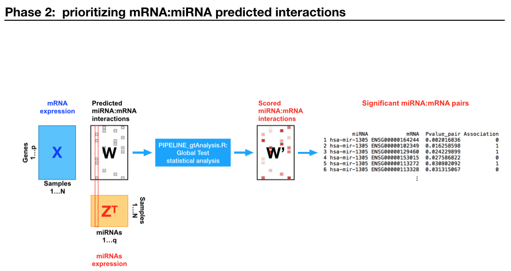

TBLAB_gtAnalysis
================
Integrated analysis of microRNA and mRNA expression using the Global Test, TCGA expression data and TBLAB putative target mRNAs.


Summary (draft)
---------------
miRNAs are small (~22 nt) RNA molecules involved in key regulatory post-transcriptional processes, and related with the  development and progressing of different diseases [7]. Therefore, deciphering miRNA targets is crucial for diagnostics and therapeutics. 

In the last decade, several sequence-complementarity based computational methods for predicting putative miRNA:mRNA interactions have been developed. However, the predicted interactions using different approaches are often inconsistent and false positive rates are still expected to be large [6].

Recently, it has been proposed to use the expression values of miRNAs and mRNAs (and/or proteins) to refine the results of sequence-based putative targets for a particular experiment. These methods have shown promising results in identifying the most prominent interactions from the databases of putative targets [5]. 

In this preliminary work, we employ the global test [2-4] to identify the most significant miRNA:mRNA interactions with respect to a particular tissue / condition as represented in expression data. Following the methodology of *Van Iterson et al.* [1], we combine RNASeqV2, miRNASeq expression data obtained from The Cancer Genome Atlas (TCGA) initiative with a set of putative target mRNAs, providing a list of significant miRNA:mRNA pairs according to the globaltest.


Global test 
-----------

For a detailed explanation and formal proofs see *Goeman et al.* [2-4]. More information about the package utils can be found in the [globaltest vignette](https://bioconductor.org/packages/release/bioc/vignettes/globaltest/inst/doc/GlobalTest.pdf).

Global test summary:
* **The idea**. Question: "Is this subset of covariates (tested group) associated with the response?" 

* **The hypothesis test**. The global test is meant for data sets in which many covariates (or features) have been measured for the same subjects, together with a response variable. The hypothesis test is as follows:
```
	- H_0:  none of the covariates in the tested group is associated with the response.
	- H_a:  *at least* one of the covariates in the tested group is associated with the response.
```

However, as explained in [1], the global test is especially directed against: 

```
	- H_a*: "most" covariates are associated with the response in a "small" way.
```

In fact, *Goeman et al.* [2-4] proves the global test is the optimal test to use against such an alternative H_a*.

* **Flexible**. The global test is based on regression models in which the distribution of the response variable is modeled as a function of the covariates. The type of regression model depends on the response:
** linear regression (continuous response),
** logistic regression (binary response),
** multinomial logistic regression (multi-class response),
** Poisson regression (count response),
** the Cox proportional hazards model (survival response).

* **Decomposable**. The global test statistic on a set of covariates (tested group) can be seen as a weighted average of the global test statistic for each individual alternative covariate (see Supplemental Material [1]).

* **Package utils**.
	1. *Diagnostic plots*: useful to assess the influence if each individual covariate in a given tested group.
	2. *Multiple testing procedures*: useful if we want to run the test multiple times using different tested groups.


Installation and Requirements
-----------------------------
To run the pipeline, some dependencies must be installed:

1. R version 3.5.1 (2018-07-02) -- "Feather Spray", can be downloaded [here](https://www.r-project.org/),
2. [Bioconductor globaltest](https://bioconductor.org/packages/release/bioc/html/globaltest.html) package.

Once (1) has been installed, the script `INSTALL.R` proceeds to install (2):
```
	$ Rscript INSTALL.R
```

A walk-through example using TCGA BRCA Batch 93 expression data and TBLAB predicted mRNA targets
------------------------------------------------------------------------------------------------
In this section, we demonstrate how to perform an integrated analysis combining mRNA-miRNA expression data, obtanined from [The Cancer Genome Atlas (TCGA)](https://tcga-data.nci.nih.gov/docs/publications/tcga/?) initiative, and a set of putative sequence-based prediction for the miRNAs involved (provided by [TBLAB](https://www.icar.cnr.it/en/laboratori-icar/bioinformatica-traslazionale-tb-lab/)), using the [globaltest](https://bioconductor.org/packages/release/bioc/html/globaltest.html) [1-4]. 

The entire pipeline can be summarized in 2 phases as follows:

### Phase 1:

<p align="center">
<figure>
  
</figure> 
</p>


#### 0. Obtaining the data
##### a) TCGA Breast Cancer miRNA, mRNA expression data (Batch 93):

Prior July 15th, 2016, [The Cancer Genome Atlas](https://tcga-data.nci.nih.gov/docs/publications/tcga/?) initiative provided the **TCGA Data Portal - Data Access Matrix**, which enabled users to build archives of desired data files. Within a given cancer project, a user could filter files based on data type, genomic characterization center, sample type, data level, sample ID, data access tier, and date submitted. The site is no longer active since all of the data have been harmonized into the brand new [NIH Genomic Data Commons (GDC) Data Portal](https://portal.gdc.cancer.gov/). 

Back in 2016, downloaded archives were organized in a directory structure that separated files according to data type (e.g., RNASeq, miRNASeq). The download included metadata and annotations that described the relationships between files and samples and additional information concerning the cases. Furthermore, within the same cancer project (e.g., Breast Cancer BRCA) there were different batches (e.g., Batch 93), each one representing a set of measurements obtained in a *single* sequencing run involving different samples (individuals).  

In order to minimize potentially confounding effects ([*batch effects*](https://www.sciencedirect.com/science/article/pii/S0167779917300367)) related to mixing different batches, we conveniently chose to restrict the scope of the analysis within a single batch. Downloaded samples were from both healthy (N=Normal) and tumor-progressing (T=Tumor) patients. 

The TCGA BRCA Batch 93 (`TCGA_BRCA_Batch93.tar.z`) data can be download at: https://drive.google.com/open?id=1R0dsZW1ZR9U6kIsg_G5P60E4ft_VtRMK.

As detailed below, our pipeline **Phase 1** uses TCGA files to construct 3 set of matrices: `T` (tumor-only patients), `N` (normal/health-only patients, and `TN` (tumor and healthy matched). Then, in this tutorial **Phase 2** (global test statistical analysis) is performed on the `T` set only.

##### b) Set of putative sequence-based mRNA targets provided by TBLAB: 

A set of predicted target mRNAs, based on sequence complementarity, is provided by [TBLAB](https://www.icar.cnr.it/en/laboratori-icar/bioinformatica-traslazionale-tb-lab/) and conveniently stored in:

``` 
datasets/TBLAB_PI_BRCA_Batch93/
├── BRCA_Batch93_PI_N_Rdata
└── BRCA_Batch93_PI_T_Rdata
```

#### 1. Unpack the downloaded data:
We assume `$GTHOME` contains the path where we've downloaded this repository and `TCGA_BRCA_Batch93.tar.z`:

```
	$ ls -l $GTHOME
	-rw-r--r--@ 1 danielegreco  staff  23399 27 Ott 13:21 BuildTCGASets.R
	-rw-r--r--@ 1 danielegreco  staff     85 27 Ott 13:21 INSTALL.R
	-rw-r--r--@ 1 danielegreco  staff   2193 27 Ott 13:21 PIPELINE_gtAnalysis.R
	-rw-r--r--@ 1 danielegreco  staff  20325 27 Ott 13:21 README.md
	-rw-r--r--@ 1 danielegreco  staff  10345 27 Ott 13:21 TBLAB_gtAnalysis_original.R
	-rw-r--r--@ 1 danielegreco  staff  10168 27 Ott 13:21 TBLAB_gtAnalysis_reverse.R
	-rw-r--r--@ 1 danielegreco  staff  550300968 27 Ott 13:23 TCGA_BRCA_Batch93.tar.z
	drwxr-xr-x@ 6 danielegreco  staff    192 27 Ott 13:25 datasets
	drwxr-xr-x@ 4 danielegreco  staff    128 27 Ott 13:21 images
	drwxr-xr-x@ 4 danielegreco  staff    128 27 Ott 13:21 lib
	drwxr-xr-x@ 7 danielegreco  staff    224 27 Ott 13:21 references	
```

Therefore, we proceed:

```
	$ mv TCGA_BRCA_Batch93.tar.z $GTHOME/datasets
	$ cd $GTHOME/datasets
	$ tar xzvf TCGA_BRCA_Batch93.tar.z
```

The new directory `$GTHOME/datasets/TCGA_BRCA_Batch93` containing all the raw files is created.


#### 2. Construct the expression matrices

Using the `BuildTCGASets_args.R` script we automatically construct the **miRNA** (`Z`) and **mRNA** (`X`) expression matrices from raw files, to be used in Phase 2 analysis:

```
	$ cd $GTHOME
	$ Rscript BuildTCGASets_args.R $GTHOME/datasets/TCGA_BRCA_Batch93/
	* Generating set T: DONE. number_of_samples=45, mRNAs=20502, miRNAs=1870
	* Generating set N: DONE. number_of_samples=14, mRNAs=20502, miRNAs=1870
	* Generating set TN: DONE. number_of_paired_samples=14, mRNAs=20502, miRNAs=1870	
```

We obtain a brand new `datasets/TCGA_BRCA_Batch93/buildTCGASets/` subdirectory with the following tree structure:	

```
datasets/TCGA_BRCA_Batch93/buildTCGASets/
├── T					# Tumor expression data
│   ├── X				# expression matrix [mRNAs]  x [samples]
│   ├── Z				# expression matrix [miRNAs] x [samples]
│   ├── mirnas.txt			# rownames(Z)
│   ├── mrnas.txt			# rownames(X)
│   └── samples.txt			# colnames of X,Z/TCGA sample unique IDs
│
├── N					# Normal expression data
│   ├── X
│   ├── Z
│   ├── mirnas.txt
│   ├── mrnas.txt
│   └── samples.txt
│
├── TN					# Tumor-Normal matched expression data
│   ├── N_samples.txt
│   ├── TN_mirnas.txt
│   ├── TN_mrnas.txt
│   ├── T_samples.txt
│   ├── X_N
│   ├── X_T
│   ├── Z_N
│   └── Z_T
│
├── buildTCGASets_REPORT.txt		# log file
├── file_manifest_N.txt			# file_manifest.txt filtered sample Numor
├── file_manifest_T.txt			# file_manifest.txt filtered sample Tumor
├── file_manifest_TN.txt		# file_manifest.txt filtered sample Tumor-Normal matched
├── samples_missing.mirbase20.txt	# samples with missing miRNASeq data
└── samples_missing.rsem.txt		# samples with missing RNASeqV2

```

The script uses the original TCGA `file_manifest.txt` within the batch to filter the data. In order to avoid spourious data, we filter out all the samples with missing RNASeqV2 and miRNASeq expression data and log them into `samples_missing.mirbase20.txt` and `samples_missing.rsem.txt` files, respectively.

Using the [Sample type codes](https://gdc.cancer.gov/resources-tcga-users/tcga-code-tables/sample-type-codes), we subset Tumor and Normal samples, creating `file_manifest_T.txt` and `file_manifest_N.txt` indexing files.

Each set of matrices (`/T`, `/N`, `/TN`) is created within its subdirectory. Let's see their basic structure in R to get an idea of how they are arranged:

```
# R interactive session
$ R

> X = read.delim(file="$GTHOME/datasets/TCGA_BRCA_Batch93/buildTCGASets/T/X_T", sep='\t', stringsAsFactors=F)
> X[1:5, 1:5]
       TCGA-BH-A0BO-01 TCGA-BH-A0C1-01 TCGA-BH-A0DO-01 TCGA-BH-A0DT-01 TCGA-BH-A18F-01 ...
1          4.975586328      7.54756129      5.95110029     5.702931416      3.81460272
29974      0.000000000      0.00000000      0.00000000     0.000000000      0.00000000
54715      0.000000000      0.79435158      0.00000000     0.018259139      0.06048762
87769      3.021424811      3.85754568      5.46446431     5.180218956      2.98751977
144568     0.009233192      0.07746402      0.03617961     0.006970869      0.11777070

> X = read.delim(file="$GTHOME/datasets/TCGA_BRCA_Batch93/buildTCGASets/T/X_T", sep='\t', stringsAsFactors=F)
> Z[1:5, 1:5]
             TCGA-BH-A0BO-01 TCGA-BH-A0C1-01 TCGA-BH-A0DO-01 TCGA-BH-A0DT-01 TCGA-BH-A18F-01
hsa-let-7a-1        8321.442       10030.033       12562.758       11251.274       10707.374
hsa-let-7a-2       16537.513       20164.943       25195.558       22558.234       21530.507
hsa-let-7a-3        8344.137       10142.977       12558.434       11287.238       10730.072
hsa-let-7b         39224.618       12019.024       36030.591       38007.926       30054.339
hsa-let-7c          4892.034        3282.716        4552.213        3141.273        3947.928
```

### Phase 2

<p align="center">
<figure>
  
</figure> 
</p>


The `PIPELINE_gtAnalysis.R` script runs the analysis. Prior to executing it, let's set its parameters:

```
# R code

################################################################
#                                                              #
#                         PARAMETERS                           #
#                                                              #
################################################################

# WORKING_DIR: root directory
args = commandArgs(trailingOnly=TRUE)
WORKING_DIR = args[1]

# EXPRESSION_DIR: output directory resulting from buildTCGASets the given expression dataset 
EXPRESSION_DIR = "datasets/TCGA_BRCA_Batch93/buildTCGASets/T"  # (T = Tumor set)

# PUTATIVE_FILE: Rdata file containing predicted putative target mRNAs for miRNAs listed in the expression dataset
PUTATIVE_FILE = "datasets/TBLAB_PI_BRCA_Batch93/BRCA_Batch93_PI_T_Rdata"

# HGNC_FILE: EnsembleId-EntrezId mapping file for protein coding genes
HGNC_FILE = "datasets/NCBI_HGNC/hgnc_protein_coding_reduced.txt"

# FDR_ALPHA: confidence level for pvalues FDR adjustament/filtering 
FDR_ALPHA = 0.01

# RESULTS_DIR: output directory for this analysis
RESULTS_DIR = ""

# DEBUG
DEBUG=NULL

```

A few notes about the parameters:

* `WORKING_DIR` corresponds to the directory where we have installed the scripts, taken from command line.
* `EXPRESSION_DIR` is where built matrices (Phase 1, see above) were successfully built. It is necessary to specify the subdirectory related to a particular set. 
* `PUTATIVE_FILE`: predicted sequence-based mRNA targets provided by TBLAB.
* `HGNC_FILE`: TBLAB uses *EnsemblIds* for genes whereas TCGA uses *EntrezIds*. This file contains a mapping between the two worlds.
* `FDR_ALPHA`: significant pairs are filtered for pvalue < FDR_ALPHA
* `RESULTS_DIR`: Phase 2 output directory: "" means "current directory".
* `DEBUG`: verbose flag.

Now, we run the analysis:
```
	$ Rscript PIPELINE_gtAnalysis.R $GTHOME
```


Following the methodology described in *Van Iterson et al.* [1] on a prostate cancer dataset, our script performs 3 steps on the data obtained in Phase 1:

1. Run the direct model analysis
2. Run the reverse model analysis
3. Intersect results from steps 1 and 2

We describe in detail *Step 1* since *Step 2* has the same workflow. Then, we show the final output on *Step 3*.


#### Step1: Global test *direct* model analysis

In the direct model analysis, we test the association between the expression of one miRNA (response variable) with the expression its set of putative predicted target mRNAs (covariates).

All of the output files are prefixed with the `rd_` (run direct). At the end of this step, `rd_FDR_significant.Rdata` stores all the significant (Pvalue_pair < `FDR_ALPHA`) miRNA:mRNA pairs:

```
       miRNA            mRNA Pvalue_global  Pvalue_pair Association      Weights  zscores
hsa-mir-1305 ENSG00000164466  4.875622e-08 9.554845e-10           1 6.243190e-05 17.69649
hsa-mir-1305 ENSG00000113494  4.875622e-08 2.792627e-08           1 2.710087e-04 15.51788
hsa-mir-1305 ENSG00000272398  4.875622e-08 3.235036e-08           1 1.000000e+00 15.41537
hsa-mir-1305 ENSG00000137414  4.875622e-08 4.869294e-08           1 1.739136e-05 15.12683
hsa-mir-1305 ENSG00000249915  4.875622e-08 8.715725e-08           1 3.140919e-04 14.70702
hsa-mir-1305 ENSG00000112249  4.875622e-08 6.890457e-07           1 6.152319e-06 13.12743
```

Entries are sorted in non-decreasing order of p-values. The `Pvalue_global` value refers to the association between a miRNA and the subset of predicted target mRNAs, whereas `Pvalue_pair`is related to the individual contribution of a miRNA:mRNA pair to the statistic (see *Van Iterson et al.* [1] and *Goeman et a.l* [2-4]).


* ##### Input:
```
# R code, within the script:

X.file 	= file.path(EXPRESSION_DIR, "X")			# mRNA expression matrix  
Z.file 	= file.path(EXPRESSION_DIR, "Z")			# miRNA expression matrix 
X.names = file.path(EXPRESSION_DIR, "mrnas.txt")		# rownames(X), mRNA labels
Z.names	= file.path(EXPRESSION_DIR, "mirnas.txt")  		# rownames(Z), miRNA labels
samples.names = file.path(EXPRESSION_DIR, "samples.txt")	# colnames(X), sample unique ID

PI.path = PUTATIVE_FILE   					# TBLAB predicted target mRNAs
HGNC.proteincoding = HGNC_FILE					# Mapping EntrezID <--> EnsemblID
FDR.alpha = FDR_ALPHA  				  		# FDR threshold
results.PATH = RESULTS_DIR					# Output directory	

```

* ##### Output:
```
	RESULTS_DIR/
		log_file_DIRECT.txt		# log file
		rd_raw.Rdata			# raw analysis results (gt.object), no FDR correction
		rd_FDR_all.Rdata		# formatted pairs with FDR correction
		rd_FDR_significant.Rdata	# formatted significant (pvalue < alpha) pairs 
		rd_FDR_FINAL_negative.Rdata	# Rdata negatively (or anti-) correlated miRNAs
		rd_FDR_FINAL_negative.tsv	# same as above , but TSV file
		rd_FDR_FINAL_positive.Rdata	# positively correlated miRNAs
		rd_FDR_FINAL_positive.tsv	# same as above, butt TSV file
```

* ##### Execution:

```
-----------------------------------------------------
globaltest ANALYSIS: DIRECT model (y=miRNAs, X=mRNAs)
    response:   single miRNA
    covariates: putative sequence based target mRNAs
-----------------------------------------------------

-- Reading expression data...
-- Retrieving PI (putative interactions) boolean matrix from TBLAB...
-- Running globaltest (direct)...OK!
-- Adjusting p-values by BH (FDR < 0.01)
-- Writing out results: direct model...
```


#### Step2: Global test *reverse* model analysis

In the reverse model analysis, we test the association between the expression of one mRNA (y, response) with its set of potentially miRNA regulators (covariates).

* ##### Input, Output:

Inputs and outputs follows the same structure as Step 1, and output files are distinguished by the `rr_` (run reverse) prefix.

* ##### Execution:

```
------------------------------------------------------
globaltest ANALYSIS: REVERSE model (y=mRNAs, X=miRNAs)
    response:   single mRNA
    covariates: predicted regulating miRNAs
------------------------------------------------------

-- Reading expression data...
-- Retrieving PI (putative interactions) boolean matrix from TBLAB...
-- Running globaltest (reversed)...OK!
-- Adjusting p-values by BH (FDR < 0.01)
-- Writing out results: reverse model...
```


#### Step3: Intersecting rd_ and rr_ significant pairs

Finally, significant pairs obtained from Step 1 and 2 are intersected and written in `FINAL_significant_pairs.tsv` 
file.

```
         miRNA            mRNA Association Pvalue_global.rd Pvalue_pair.rd   Weights.rd zscores.rd
hsa-mir-3661 ENSG00000107104           1     0.0004491193   1.270320e-08 2.264966e-05  16.055829
hsa-mir-3661 ENSG00000130675           1     0.0004491193   3.962157e-06 1.487302e-07  11.677656
hsa-mir-3661 ENSG00000158457           1     0.0004491193   1.200039e-09 1.356626e-05  17.559449
hsa-mir-3661 ENSG00000187140           1     0.0004491193   7.139225e-16 3.352004e-08  23.937336
hsa-mir-3661 ENSG00000240583           1     0.0004491193   1.350887e-14 7.453400e-04  22.944931
hsa-mir-451a ENSG00000102181           1     0.0002903367   4.793666e-03 1.274764e-05   4.656324
  Pvalue_global.rr Pvalue_pair.rr   Weights.rr zscores.rr
     1.509030e-06   1.270320e-08 2.501506e-07  16.055829
     3.513105e-06   3.962157e-06 3.467903e-07  11.677656
     3.554187e-07   1.200039e-09 2.501506e-07  17.559449
     6.942664e-09   7.139225e-16 2.501506e-07  23.937336
     3.962503e-08   1.350887e-14 2.501506e-07  22.944931
     1.659414e-06   4.793666e-03 2.954316e-05   4.656324
```


Code explanation in detail
--------------------------
To be written. See commments within the code. 


References
----------
- [1] *Maarten van Iterson, Sander Bervoets, Emile J. de Meijer, Henk P. Buermans, Peter A. C. ’t Hoen, Renée X. Menezes, Judith M. Boer*; Integrated analysis of microRNA and mRNA expression: adding biological significance to microRNA target predictions, Nucleic Acids Research, Volume 41, Issue 15, 1 August 2013,

- [2] *Goeman JJ, Oosting J (2016)*. Globaltest: testing association of a group of genes with a clinical variable. R package version 5.34.0.

- [3] *Goeman JJ, van de Geer SA, van Houwelingen JC (2006)*. “Testing against a high-dimensional alternative.” Journal of the Royal Statistical Society, Series B, 477-493.

- [4] *Goeman JJ, van de Geer SA, de Kort F, van Houwelingen JC (2004)*. “A global test for groups of genes: testing association with a clinical outcome.” Bioinformatics, 93-99.

- [5] *Ander Muniategui, Jon Pey, Francisco J. Planes, Angel Rubio;* Joint analysis of miRNA and mRNA expression data, Briefings in Bioinformatics, Volume 14, Issue 3, 1 May 2013, Pages 263–278, 

- [6] *Riffo-Campos, Á. L., Riquelme, I., & Brebi-Mieville, P.* Tools for Sequence-Based miRNA Target Prediction: What to Choose?. International journal of molecular sciences, 17(12), 1987.

- [7] *Paul P, Chakraborty A, Sarkar D, et al.* Interplay between miRNAs and human diseases. J Cell Physiol. 2018;233:2007–2018. 
